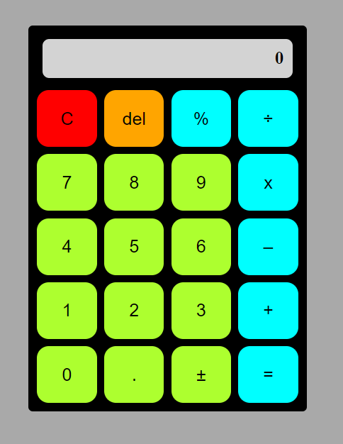

# odin-calculator

## Description

The goal of this project is to create a browser based calculator. This includes a GUI and is created with the combination of HTML, CSS and JavaScript.

## Table of Contents

- [Explanation of Marking](#explanation-of-marking)
- [Keyboard Shortcuts](#keyboard-shortcuts)
- [Logic of the Calculator](#logic-of-the-calculator)
- [To-do](#to-do)
- [Layout](#layout)
- [Credits](#credits)

## Explanation of Marking

The following apply when talking about operations done in the calculator.
The '[+-]' means ''plus minus'', '(=)' means that the calculator shows/should show whatever is typed after '(=)' (in other words, '=' is not typed but the calculator automatically shows something that it did not show before), others are self evident.

## Keyboard Shortcuts

'0123456789' for numbers

'.' for decimal

'+' for plus

'-' for minus

'/' for division

'\*' for multiplication

'Backspace' for deleting last typed character

'C' for resetting to default starting position

'Enter' and '=' for equals

## Logic of the Calculator

There is a maximum amount of characters (numbers plus the decimal point) that can be displayed, 16, as well as maximum amount of decimals for typing, 7. This is
due to limited space in the ''physical'' calculator.

The button 'del' removes the last typed digit while 'C' resets everything to the default (the scenario you start with).
The button '%' works the following way. If you type '9 %', this is calculated as ten percent of nine, i.e. 0.9.
If you type '9 + 9 %' this is calculated as '9 + 0.81' which equals to 9.81. Curiously, if you instead type '9 + %'
this is treated same as '9 + 9 %', i.e. the second number is assumed to be the same as the first number.
This follows the same logic as the default calculator in a certain operating system. Note that if you want some other
percentage of a number other than that which equals to that number, you can always type 'x + y %' where x is the number from
which the percentage is taken and y is the percentage.

If you type '3 + =' this results in '6' and if you keep of pressing the equals sign, 3 keeps on getting added to the number (6,9,12, etc.).
This also works with other operations, if only one number is defined and an operation is specified, the other number is assumed
to be the same number that was typed in the first place, e.g. '3 \* = 9 = 27 = 81 ...'.
On the other hand, '3 + + + + +' does not add 3's, you should do '3 + = = = = =' instead.

The calculator allows you to change your mind on an operator, i.e. type '6 - + 6' which will result in '12'.

## To-do

(Mostly floating point math fixes, below is one example)

- [ ] SHOULD BE: 6.0006 [+-] (=)-6.0006 + 3 = -3.0006
- [ ] SHOULD BE: 0.3 + 0.4 = 0.7 + 0.1 = 0.8

## Layout

Deployment: [here](https://juhalo.github.io/odin-calculator/)

The general look is below:

## Credits

Link to the original github page of the project by theodinproject is [here](https://github.com/TheOdinProject/curriculum/blob/main/foundations/javascript_basics/project_calculator.md)
